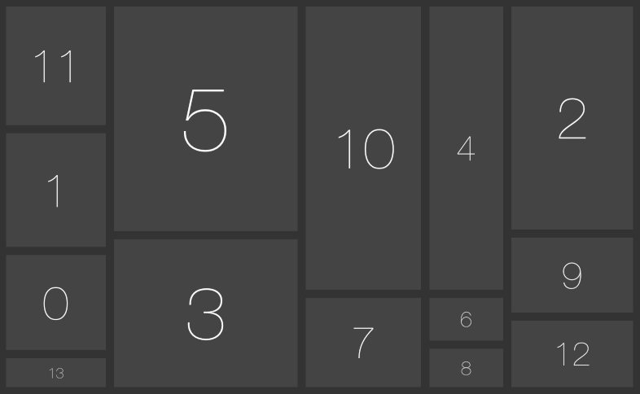

# Occamy

> *The Occamy grows or shrinks in order to fit available space.*



Occamy aranges and scales all elements within a containter element to fit available space while keeping the elements relative size and aspect ratio close. It's pure plain vanilla JS and less than 1.6K in size when gzipped.

## Usage

``` javascript
var occ = occamy(container, options[, dom]);
```

The container Element can eiter be an instance of `HTMLElement` or a Ouery Selector like `'#container'`.

If you use Occamy from node.js, pass your `window.document` as third parameter;

## Options 

* `dir`: *`row`* or *`col`* for row or column layout; omit for autopilot.
* `prefix`: alternative prefix for `occamy-item` css elements
* `gap`: gap between elements in pixels

### Instance Methods

#### occamy.redraw()

Rearrange elements.

``` javascript
var occ = occamy('#container');
window.addEventListener("resize", function(){
	occ.redraw();
});
```

#### occamy.destroy()

Remove occamy.

``` javascript
var occ = occamy('#container');
document.addEventListener('keydown', function(evt){
	if (27 === evt.keyCode) occ.destroy();
});
```

## Example

See [Demo](example/demo.html)

## License

[Unlicense](http://unlicense.org/UNLICENSE)
